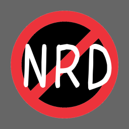

  
  <h1 align="center">NRDBlocker</h1>
  
Block Newly registered domain (NRD) for prevent threats

## What is an NRDs, and why should it be blocked?
NRD stands for Newly registered domain and refers to domains registered within the last few months.

Many of these domains can be used to distribute fraud and malware, and blocking them is expected to improve user security.

## Super Thanks
* [cenk/nrd](https://github.com/cenk/nrd) // Database of NRDs
